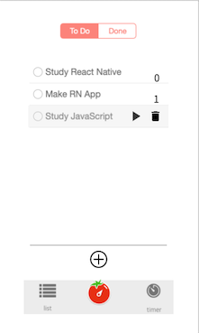
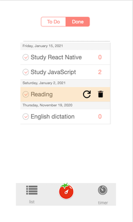
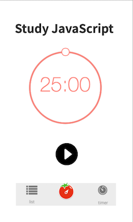
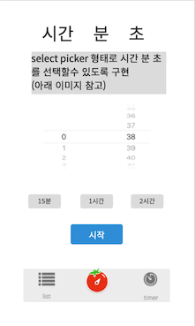
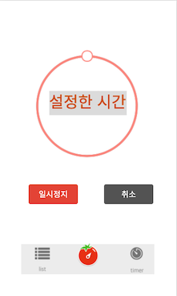

# Befocused

> Clone simple [Be Focused App](https://apps.apple.com/kr/app/be-focused-focus-timer/id973130201) using react native

> Development Environment : Use `React Native CLI`

## Motivataion

안타까운 `코로나 시대`에 **재택근무**를 해야하는 상황이 되었다. 재택근무에 대한 장단점이 분명 존재한다. 내가 생각하는 장점은 <u>시간을 좀 더 유연하고 효율적으로 사용할 수 있다는 점</u>이다. 반면 단점은 <u>시간에 대한 절제 능력이 떨어질 수 있다는 것</u>이다. 이 부분은 사람이라면 당연하게 나타날 수 밖에 없는 본능이라고 생각한다. 혼자 있을 때, 자신에게 좀 더 엄격해져야하지만 실제로 그러기가 쉽지않기 때문이다. 이러한 단점을 극복하기 위해서 시간 관리를 위한 나만의 앱을 만들어 보기로 했다. 위에서도 언급했지만 단순한 [포모도로 기법](https://ko.wikipedia.org/wiki/%ED%8F%AC%EB%AA%A8%EB%8F%84%EB%A1%9C_%EA%B8%B0%EB%B2%95)을 구현한 앱에 몇 가지 `내가 필요한 기능들`을 추가할 계획이다.

## Structures & Features

> 아래는 앱이 어떻게 만들지에 대한 `명세표`이다.

> 현재 총 5개의 screen으로 구성 할 예정이다. 추가로 Calendar Screen 생각 중인데, 아직 어떤 식으로 구성할지에 대해서 미정이다.

> 아래의 이미지들은 구현하고자 하는 컴퍼넌트들을 `프로토타입`으로 구현해본 것이다. 실제와 차이가 있을 수 있다.

### Todo Screen

- `+ 버튼`을 누르면 빈 텍스트의 todo가 생성된다.

- 포커싱이 없는, 일반 todo의 우측에는 해당 todo를 완료한 횟수가 기록된다.

- 특정 todo에 포커싱을 주면 `플레이 버튼`과 `삭제 버튼` 이 활성화 된다.

- `플레이 버튼`은 해당 todo를 바로 토마토 타이머를 시작할수 있다.

- `삭제 버튼`은 해당 todo를 삭제한다.

- 상단의 버튼은 리스트(해야 할 일 /한 일)를 변경할 수 있다.

- 좌측의 체크박스를 클릭하여 `done 상태`로 만들 수 있다. 자동으로 `한 일 리스트`로 이동한다.

### Done Screen

- 날짜 별로 todo가 정렬된다.

- 포커싱이 없는, 일반 todo의 우측에는 해당 todo를 완료한 횟수가 기록된다.

- 특정 todo에 포커싱을 주면 `리셋 버튼`과 `삭제 버튼`이 활성화 된다.

- `리셋 버튼`은 해당 todo를 todo 상태로 변경할 수 있다. 자동으로 `할 일 리스트`로 이동한다.

- `삭제 버튼`은 해당 todo를 삭제한다.

### Tomato Screen

- 상단에는 해당 todo의 `타이틀`을 표시한다.

- 시간에 따라서 `원형 프로그래스바`가 움직인다.

- 완료되면 `특정 표시(or 알림)` 후에 해당 todo는 `한 일 리스트`에 기록된다.

- `시작 버튼`을 누르면 타이머가 시작되고, `리셋 버튼`과 `일시 중지 버튼`으로 변경 된다.

- `리셋 버튼`은 타이머를 초기화한다. 버튼의 구성도 초기화한다.

- `일시 중지 버튼`을 누르면 타이머가 정지하고 일시 중지 버튼은 `계속 버튼`으로 변경 된다. 다시 계속 버튼을 누르면 타이머가 재시작하고 계속 버튼은 일시 중지 버튼으로 바뀐다.

### Timer Screen

- 내가 `원하는 시간`을 설정할 수 있다.

- 설정한 시간에 맞게 `원형 프로그래스바`가 조절된다.

- 완료되면 `특정 표시(or 알림)`를 준다.

- `시작 버튼`을 누르면 타이머가 시작되고, 버튼의 `구성이 변경`된다.

- `일시정지/취소 버튼`은 기존의 토마토 스크린과 동일하게 작동한다.

- 몇가지 기본값으로 `빠른 설정을 위한 버튼`을 설정할 수 있다. 자주 사용하는 타이머를 3가지로 미리 설정할 수 있다.
